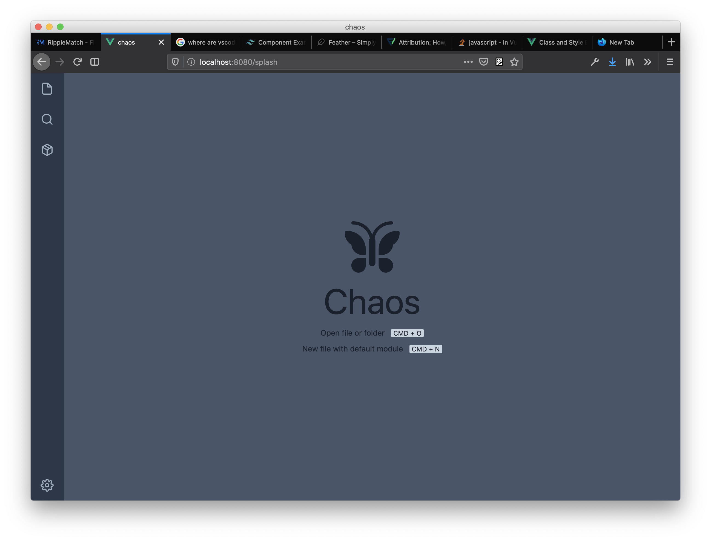

# Chaos

A novel system for organization of diverse digital data 

## Table of contents

- [Chaos](#chaos)
  - [Table of contents](#table-of-contents)
  - [Introduction](#introduction)
  - [Current screenshot](#current-screenshot)
  - [Develop](#develop)
    - [macOS](#macos)
  - [Build](#build)
  - [Latest release](#latest-release)

## Introduction

Much of the data we produce and collect now lives on the web, but it can be surprisingly fragile and ephemeral. Interesting content, including articles, images or streaming video may vanish due to link rot. Creative and productive tools, many now offered as web apps or services, may shutdown at any point, offering limited migration paths. It does not help that most of our data is stored in proprietary and inaccessible formats, instead of building on open standards or extending the capabilities of the operating system (OS). Moreover, the web apps we use daily are rarely interoperable, and so our data exists in silos, as evidenced by the dozens of app windows that we juggle in our daily workflows.

Chaos is a system for the organization, preview and archival of diverse digital information. It is driven by a few powerful assumptions about the inherent similarities of web apps and the data they produce. In doing, it aims to do for web app data what the OS has done for native app data. First, Chaos proposes an open, container file format that brings web apps into the realm of the file system. Second, it introduces a programmatic and graphical interface for the creation, editing and organization of these files. With its modular architecture, the use cases are theoretically infinite: users can archive links, write notes, hold conversations and pull data from their favorite apps, all in a single interface, with the proposed file format at its foundation. In sum, Chaos is an unconventional undertaking to wrangle the chaos of our digital age.

## Current screenshot



## Develop

```
yarn install
yarn electron:serve
```

### macOS

Make sure that either Xcode or the Xcode Command Line Tools are installed.

## Build

- Declare any external dependencies in `vue.config.js`. 
- When compiling for multiple platforms, make sure that platform-specific code is wrapped appropriately. 

```
yarn electron:build
```

View the built app in `dist_electron`.

## Latest release

Can be found in <https://github.com/sarimabbas/chaos/releases/latest>.
